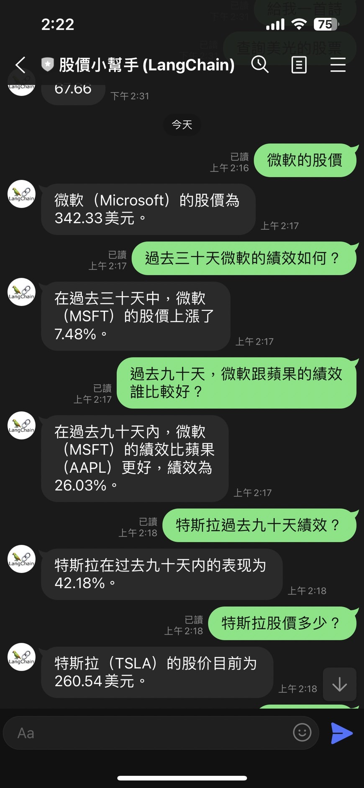

Utilizing a LINE Bot integrated with LangChain in Python to assist with stock price inquiries
==============

Installation and Usage
=============

### 1. Got A LINE Bot API devloper account

- [Make sure you already registered on LINE developer console](https://developers.line.biz/console/), if you need use LINE Bot.

- Create new Messaging Channel
- Get `Channel Secret` on "Basic Setting" tab.
- Issue `Channel Access Token` on "Messaging API" tab.
- Open LINE OA manager from "Basic Setting" tab.
- Go to Reply setting on OA manager, enable "webhook"

### 2. To obtain an OpenAI API token

- Register for an account on the OpenAI website at <https://openai.com/api/>.
- Once you have an account, you can find your [API Keys](https://platform.openai.com/account/api-keys) in the account settings page.
- If you want to use the OpenAI API for development, you can find more information and instructions in the API documentation page.
- Please note that the OpenAI API is only available to users who meet certain criteria.
- You can find more information about the usage conditions and limitations of the API in the API documentation page.

### 3. Deploy this on Web Platform

You can choose [Heroku](https://www.heroku.com/) or [Render](http://render.com/)

### 4. Deploy this on Heroku

- Input `Channel Secret` and `Channel Access Token`.
- Input [OpenAI API Key](https://platform.openai.com/account/api-keys) in `OPENAI_API_KEY`.
- Remember your heroku, ID.

### 5. Go to LINE Bot Dashboard, setup basic API

- Setup your basic account information. Here is some info you will need to know.
- `Callback URL`: <https://{YOUR_HEROKU_SERVER_ID}.herokuapp.com/callback>

It all done.

License
---------------

Licensed under the Apache License, Version 2.0 (the "License");
you may not use this file except in compliance with the License.
You may obtain a copy of the License at

<http://www.apache.org/licenses/LICENSE-2.0>

Unless required by applicable law or agreed to in writing, software
distributed under the License is distributed on an "AS IS" BASIS,
WITHOUT WARRANTIES OR CONDITIONS OF ANY KIND, either express or implied.
See the License for the specific language governing permissions and
limitations under the License.
